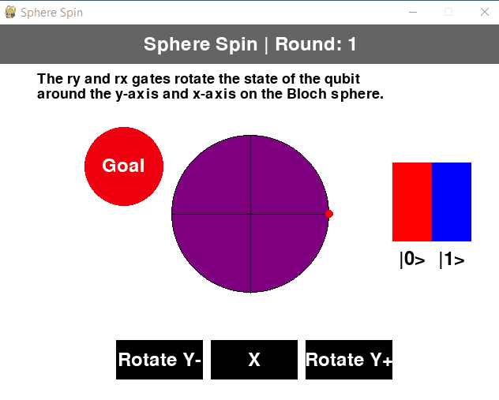

Sphere Spin
===========

A quantum computing game developed with ChatGPT4.

Match the colored sphere!

## How to Play

The goal of the game is to match your colored sphere with the goal sphere.

Your sphere will change color according to the rotation of your qubit around the Bloch sphere. You can perform actions including Ry+, Ry-, Rx+, and Rx- to rotate the qubit accordingly. As your qubit rotates, the color will adjust according to the measurements of 0 and 1 outcomes from the qubit.

When your sphere matches the same measurement outcome, and color, of the goal sphere you advance to the next round!

How many rounds can you win?

## Screenshots

## License

MIT

## Author

Kory Becker http://www.primaryobjects.com/kory-becker